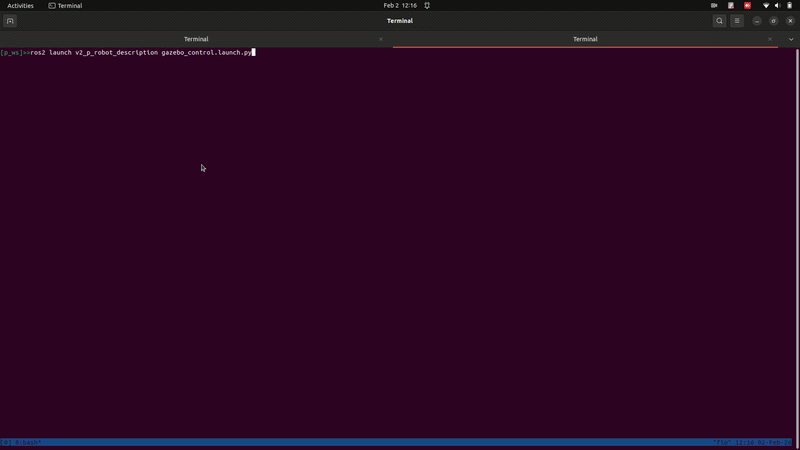
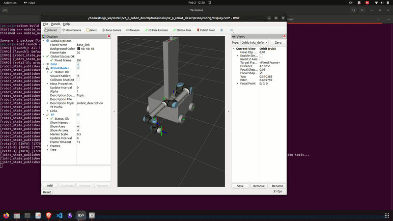
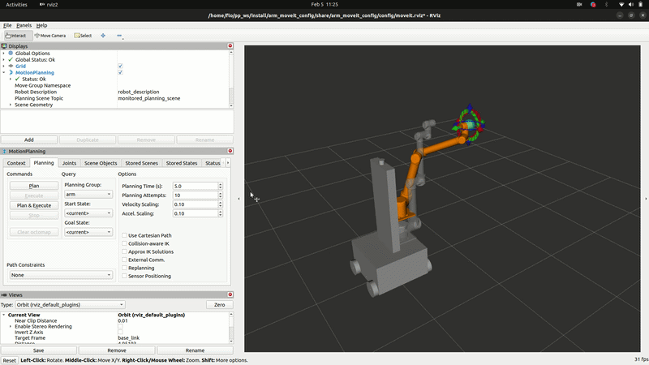

# General purpose robot — ROS 2 Description & MoveIt Configuration

A general-purpose mobile manipulator robot built in ROS 2, featuring a 4-wheeled differential-drive base with an onboard robotic arm, a torso lift, and a LiDAR sensor. The project includes full URDF/Xacro description, Gazebo simulation, and MoveIt 2 motion planning.

---

## Robot Overview

| Feature | Details |
|---|---|
| Base | 4-wheel differential drive (front-left, front-right, rear-left, rear-right) |
| Arm | 7-DOF custom arm (motor1–motor7 joints) mounted on a torso |
| Torso | Vertical lift joint connecting base to arm |
| Sensor | LiDAR (fixed mount on base_link at height 1.55 m) |
| Simulation | Gazebo (Classic) with `gazebo_ros2_control` |
| Motion Planning | MoveIt 2 with KDL kinematics solver |
| Controller | `joint_trajectory_controller` via `ros2_control` |

### Planning Groups (MoveIt)

| Group | Joints |
|---|---|
| `arm` | `torso_joint`, `motor1_joint` → `motor7_joint` |

### Predefined Arm Poses

- **zero** — all joints at 0
- **home** — a safe raised configuration (motor1: -1.1084, motor2: -0.1475, motor3: 0.3344, motor5: -1.3364, motor6: -0.6422, motor7: 1.5447)

---

## Package Structure

```
v2_p_robot_description/       # Robot description package
├── urdf/
│   ├── v2_p_robot.xacro          # Top-level xacro entry point
│   ├── v2_p_robot_urdf.xacro     # Full URDF definition (links, joints, sensors)
│   ├── v2_p_robot_ros2_control.xacro  # ros2_control hardware interface
│   ├── v2_p_robot.gazebo         # Gazebo plugin definitions
│   ├── v2_p_robot.trans          # Transmission definitions
│   └── materials.xacro           # Visual materials
├── meshes/                        # STL mesh files for all links
├── config/
│   └── display.rviz              # RViz configuration
├── worlds/                        # Gazebo world files
└── launch/
    ├── display.launch.py          # RViz visualization launch
    └── gazebo.launch.py           # Gazebo simulation launch

arm_moveit_config/                # MoveIt 2 configuration package
├── config/
│   ├── v2_p_robot.srdf            # Semantic robot description
│   ├── kinematics.yaml            # KDL solver settings
│   ├── joint_limits.yaml          # Velocity/acceleration limits
│   ├── moveit_controllers.yaml    # MoveIt controller bindings
│   ├── ros2_controllers.yaml      # ros2_control controller config
│   ├── initial_positions.yaml     # Default joint start positions
│   └── pilz_cartesian_limits.yaml # Pilz planner Cartesian limits
└── launch/
    └── demo.launch.py             # MoveIt demo launch (RViz + planning)
```

---

## Prerequisites

- ROS 2 (Humble or later recommended)
- `ros2_control`, `ros2_controllers`
- `moveit_ros_planning_interface`, `moveit_configs_utils`
- `gazebo_ros`, `gazebo_ros2_control`
- `robot_state_publisher`, `joint_state_publisher_gui`
- `rviz2`

Build all packages in your workspace:

```bash
cd ~/your_ws
colcon build --symlink-install
source install/setup.bash
```

---

## Launching

### 1. Visualize in RViz (with Joint State GUI)

Loads the robot URDF and opens RViz with a joint slider GUI to manually move joints.

```bash
ros2 launch v2_p_robot_description display.launch.py
```

To disable the GUI and use a headless joint state publisher instead:

```bash
ros2 launch v2_p_robot_description display.launch.py gui:=false
```


---

### 2. Simulate in Gazebo

Spawns the robot in a Gazebo world with `ros2_control` active, a `joint_trajectory_controller`, and optional RViz/teleop.

```bash
ros2 launch v2_p_robot_description gazebo.launch.py
```

#### Available launch arguments

| Argument | Default | Description |
|---|---|---|
| `world` | `empty` | World to load (`empty`, `maze`) |
| `use_sim_time` | `true` | Use Gazebo simulation clock |
| `gui` | `true` | Show Gazebo GUI window |
| `rviz_enabled` | `true` | Launch RViz alongside Gazebo |
| `teleop_enabled` | `true` | Launch keyboard teleop node |
| `verbose` | `false` | Enable Gazebo verbose output |
| `namespace` | `` | ROS namespace for all topics |
| `robot_x` | `0.0` | Spawn X position |
| `robot_y` | `0.0` | Spawn Y position |
| `robot_yaw` | `0.0` | Spawn yaw orientation |

Example — spawn in a maze world without teleop:

```bash
ros2 launch v2_p_robot_description gazebo.launch.py world:=maze teleop_enabled:=false
```



---

### 3. MoveIt 2 Motion Planning (Demo Mode)

Launches the full MoveIt 2 stack with RViz and the MotionPlanning plugin. Uses fake hardware (no physical robot or Gazebo required).

```bash
ros2 launch arm_moveit_config demo.launch.py
```

In RViz, use the **MotionPlanning** panel to:
- Set a goal pose for the `arm` planning group
- Plan and execute trajectories
- Move to named states (`zero`, `home`) from the **Goal State** dropdown



---

## Controller Configuration

The `arm_trajectory_controller` manages all 7 arm joints plus the torso:

```
torso_joint, motor1_joint, motor2_joint, motor3_joint,
motor5_joint, motor6_joint, motor7_joint
```

Command interface: `position`  
State interfaces: `position`, `velocity`  
Controller update rate: **100 Hz**

Joint velocity scaling defaults are set conservatively at **10%** in `joint_limits.yaml`. Increase `default_velocity_scaling_factor` (up to `1.0`) for faster motion.

---

## Kinematics

The `arm` planning group uses the KDL kinematics solver:

```yaml
kinematics_solver: kdl_kinematics_plugin/KDLKinematicsPlugin
kinematics_solver_search_resolution: 0.005
kinematics_solver_timeout: 0.005
```

---

## Notes

- The wheel joints (`front_*`, `rear_*`) are marked as **passive** in the SRDF and are excluded from MoveIt planning.
- The LiDAR link is fixed to `base_link` at z = 1.55 m.
- `motor4_joint` is an internal passive joint in the arm linkage and is not included in the trajectory controller.
- The Gazebo launch file contains commented-out stubs for a differential drive controller and UR arm integration — these can be re-enabled for future configurations.